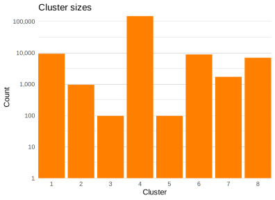

# Background

## Data

<ul>
<li>Title & cast data from [IMDB database](https://www.imdb.com/interfaces/)</li>
<li class="fragment fade-up">Focus on **mainstream movies**
  <ul>
  <li>removed: TV series, shorts, adult content</li>
  <li>subsetted largest connected component</li>
  </ul>
</li>
<li class="fragment fade-up">Incidence matrix
  <ul>
  <li>$\sim\!463\text{K}\!\times\!607\text{K}$ &nbsp; ($\text{titles}\!\times\!\text{actors}$)</li>
  <li>$\sim\!99.999\%$ sparsity</li>
  </ul>
</li>
<li class="fragment fade-up">Additional attributes:
  <ul>
  <li>title/actor names</li>
  <li>country/language info (scraped)</li>
  </ul>
</li>
</ul>

## Previous work

<ul>
<li>Node centrality analysis (see [blog](https://bwu62.github.io/992Project/#centrality))</li>
<li class="fragment fade-up" data-fragment-index="1">Factor analysis with [`VSP`](https://github.com/RoheLab/vsp)
  <ul>
  <li class="fragment fade-up" data-fragment-index="1">Goal: Group films by **genre** based on cast</li>
  <li class="fragment fade-up" data-fragment-index="2">Result: Grouped by **country/language** instead</li>
  </ul>
</li>
<li class="fragment fade-up" data-fragment-index="3">Retried with English-only titles
  <ul>
  <li>Clusters have strange **cliques**</li>
  </ul>
</li>
</ul>

## Cliques

# Next steps

## Cluster Balancing

<ul>
<li>Goal: extract better **genre** info with `vsp`</li>
<li>Try: encourage larger, more balanced clusters</li>
<li class="fragment fade-up" data-fragment-index="1">Methods to try:
 <ul>
 <li class="fragment fade-up" data-fragment-index="1">Transform (projected) adjacency matrix $AA^\text{T}$ (titles)?</li>
 <li class="fragment fade-up" data-fragment-index="2">Identify and contract clique/outlier nodes?
 <ul>
  <li class="fragment fade-up" data-fragment-index="2">PPR on $A^\text{T}A$ (actors)?</li>
  <li class="fragment fade-up" data-fragment-index="3">Predict using other metrics?    
  e.g., coreness, degree, centrality, etc.</li>
 </ul>
 </li>
 <li class="fragment fade-up" data-fragment-index="4">Something else??</li>
 </ul>
</li>
</ul>

# Questions?

<small>(special thanks to Karl Rohe for his guidance throughout this project)</small>

